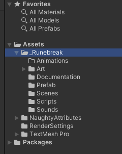
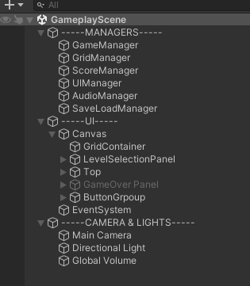
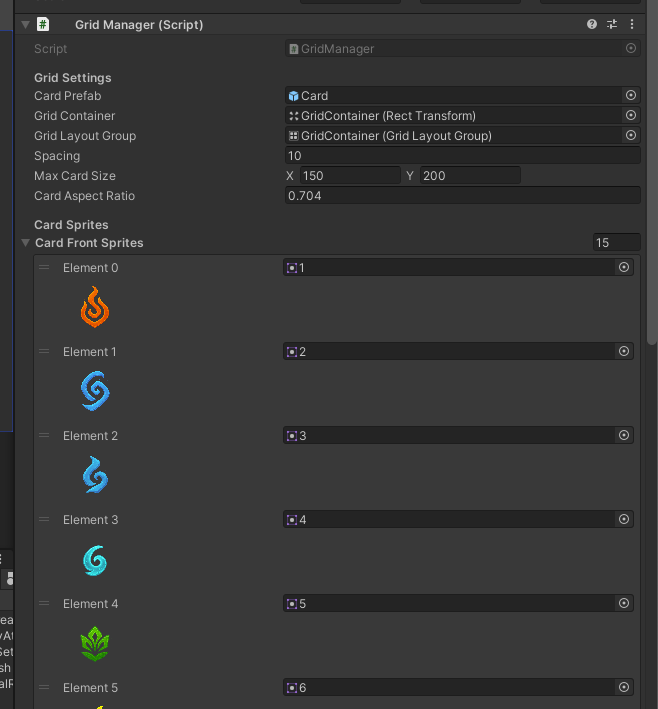

# RuneBreak Card-Match Prototype

A polished Unity 2021 LTS memory-game prototype with dynamic layouts, layered card visuals, combo-driven scoring, and persistent progress.

---

## Quick Links

- 🎥 **Gameplay Recording:** [Recordings/Gameplay.mp4](Recordings/Gameplay.mp4)
- 📄 **Unity Project Notes:** [Assets/_Runebreak/Documentation/UnityProjectNotes.md](Assets/_Runebreak/Documentation/UnityProjectNotes.md)

---

## Feature Highlights

- **Dynamic layouts** – 2×2, 2×3, 4×4, 4×5, 5×6 boards auto-scale to the display container.
- **Smooth card interactions** – UI-based flip animation, layered frame & glow effect, hover SFX with pitch variance.
- **Scoring & combos** – Base points plus combo multiplier, tracked alongside moves and remaining pairs.
- **Save & resume** – JSON persistence keeps grid state, score, and layout choice between sessions.
- **Inspector quality-of-life** – NaughtyAttributes `ShowAssetPreview` exposes sprite thumbnails.

---

## Screenshots

---

## Getting Started

1. Open the project in **Unity 2021 LTS** (URP baseline).
2. Load `Assets/_Runebreak/Scenes/GameplayScene.unity`.
3. Press **Play**. Use the top buttons to switch board layouts or restart.
4. Hover and flip cards to experience the SFX/FX feedback. Completing the board triggers the game-over summary.

---

## Gameplay Notes

- Hovering a card triggers a subtle glow and randomized-pitch hover sound.
- Flipping reveals the card front; matching pairs pulse the glow and lock in place.
- Score/Moves/Pairs remain visible in the HUD; combos reward consecutive matches.
- Restart keeps the last selected layout; deleting `Application.persistentDataPath/gamesave.json` resets progress.

---

## Asset Credits

### Visuals
- **Card back & overlays**: Custom artwork by the developer.
- **Card front symbols**: AI-generated imagery, curated and integrated specifically for this prototype.

### Audio
- Sound effects sourced from **Zapsplat** and **Freesound.org** (see original filenames in `Assets/_Runebreak/Sounds/`).

---

## Tooling & Workflow

- Engine: Unity 2021 LTS (URP)
- Assistance: Cursor CLI workflow (analogous to Claude/Codex CLI modes)
- Packages: NaughtyAttributes for improved Inspector UX; Unity 2D Sprite package
- Save format: JSON (`Application.persistentDataPath/gamesave.json`)

---

## Extra Documentation

- `Assets/_Runebreak/Documentation/UnityProjectNotes.md` – deeper dive into architecture, assets, and scene setup.
- Screenshots and usage examples live alongside that markdown for quick reference.

---

Enjoy exploring RuneBreak! 🎴
